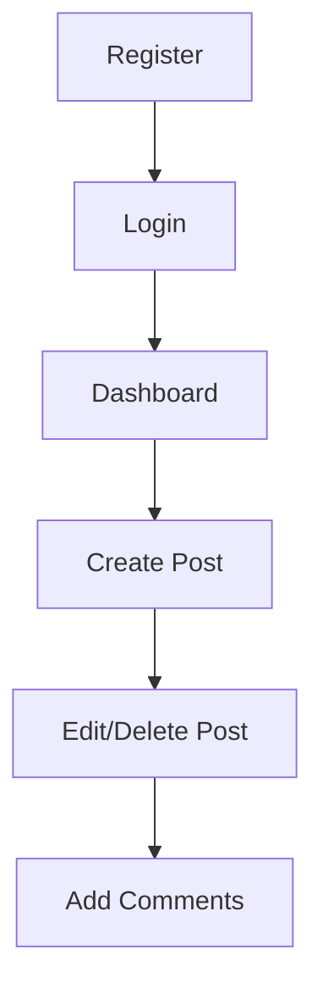

<!-- 🌈 Banner -->

<p align="center">
  
</p>

<h1 align="center">📝Aniliem Blog Site </h1>

<p align="center">
  🚀 A modern PHP-based blog system with authentication, posts & comments  
</p>

<p align="center">
  
  
</p>

---

## ✨ Overview

This project is a **dynamic blog platform** where users can create, manage, and interact with posts.
It is built as a **full-stack academic project** using PHP and MySQL.

---

## 🚀 Features

✨ Clean and simple UI
🔐 Secure login & registration system
📝 Full CRUD for blog posts
💬 Comment system
🗂️ Category management
🖼️ Image upload support

---

## 🛠️ Tech Stack

| Layer        | Technology   |
| ------------ | ------------ |
| 💻 Backend   | PHP          |
| 🗄️ Database | MySQL        |
| 🎨 Frontend  | HTML, CSS    |
| ⚙️ Server    | XAMPP / WAMP |

---


## ⚙️ Installation Guide

### 🔽 Clone Repository

```bash id="7cv6f7"
git clone https://github.com/your-username/blogpost.git
cd blogpost
```

---


### 🗄️ Database Setup

1. Open **phpMyAdmin**
2. Create database:

```id="1xmpxy"
blog_db
```

3. Import SQL file (if available)

---

### 🔌 Configure Connection

Edit `db.php`:

```php id="m3vq1p"
$conn = mysqli_connect("localhost", "root", "", "blog_db");
```

---

### ▶️ Run Project

```id="y2v03q"
http://localhost/blogpost/
```

---

## 📂 Project Structure

```id="c86q7g"
blogpost/
│
├── 🔐 auth/
│   ├── login.php
│   ├── register.php
│   └── logout.php
│
├── 📝 posts/
│   ├── insertpost.php
│   ├── updatepost.php
│   └── deletepost.php
│
├── 💬 comments/
│   └── insertcomment.php
│
├── 🗂️ category/
│   └── addcategory.php
│
├── ⚙️ config/
│   └── db.php
│
├── 🎨 assets/
│   ├── style.css
│   └── images/
│
└── index.php
```

---

## 🎯 Usage Flow



---


## 📜 License

📘 This project is for **educational purposes only**

---


<!-- 🌈 Footer -->

<p align="center">
  
</p>
